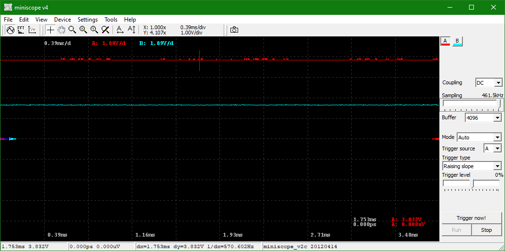
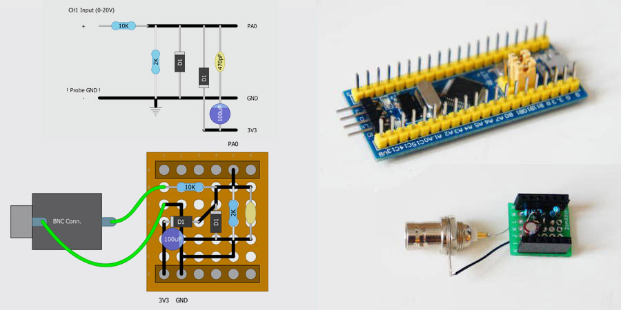
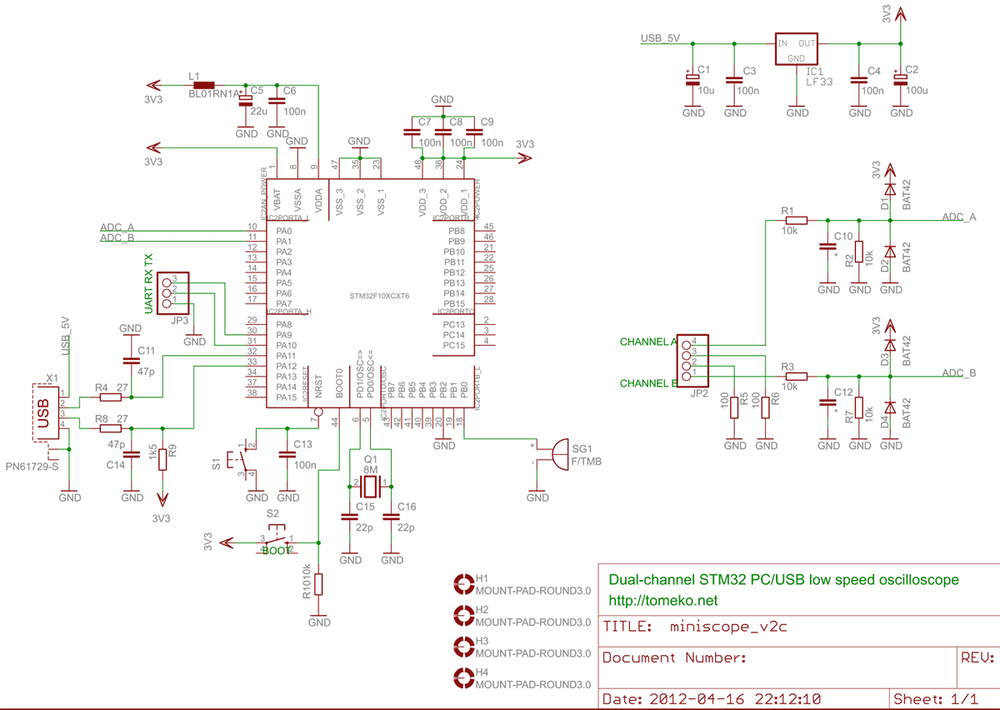
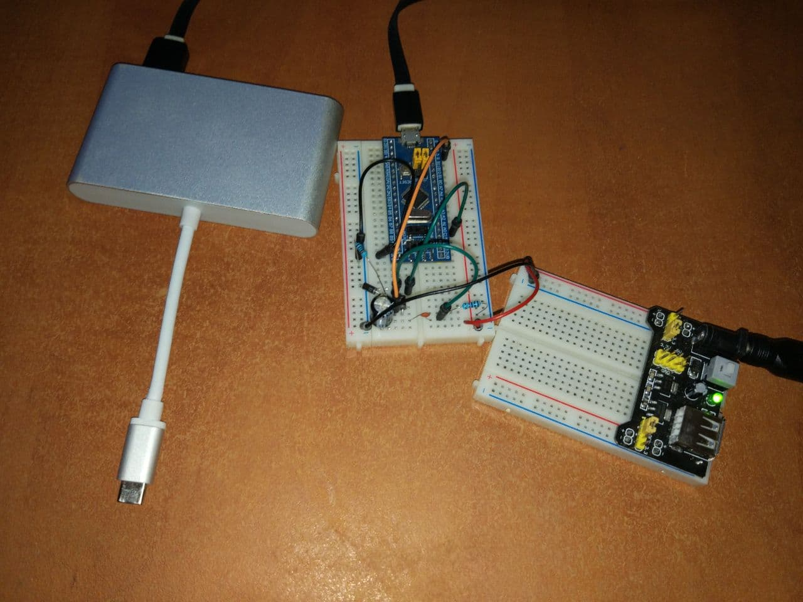
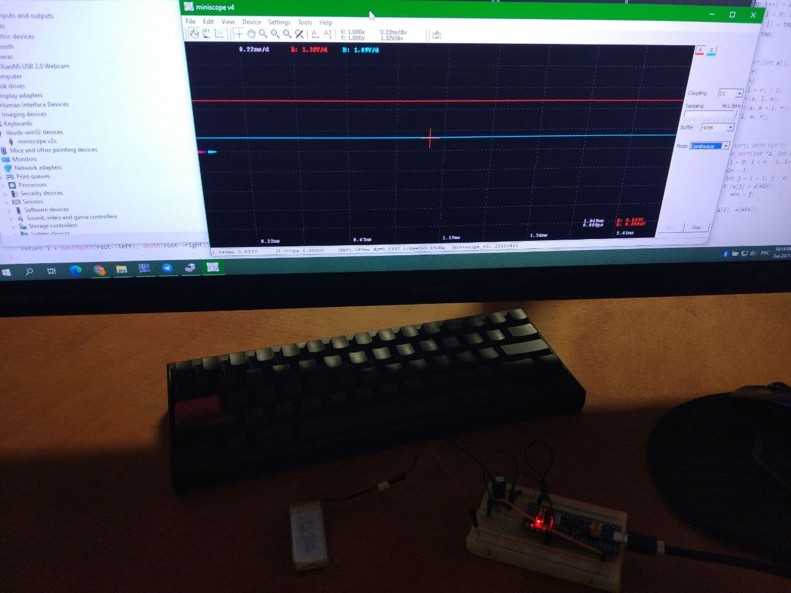

# HS10x opensource

An attempt to run popular HS10x DIY oscilloscope (Bluepill mod) on PC

## Disclaimer

The purpose of this project was to use popular
Bluepill hardware mod on Windows 10 (I don't like phones) and gather everything in one place.
Currently it's just stm32scope firmware running on a HS10x hardware. Data is displayed by miniscope.

Related links:

* http://hscope.martinloren.com/HS101-oscilloscope.html
* http://tomeko.net/miniscope_v2c
* http://tomeko.net/miniscope_v4

## TODO

* Implement "SUMP protocol" for sigrok as here: https://github.com/michar71/Open-DSO-150/issues/41
Maybe start from stm32duino version for sigrok: https://github.com/ag88/SumpSTM32F401cc

* Port [DSO138 firmware](https://github.com/ardyesp/DLO-138) (hopefully) and make it work with Hantek-compatible
PC software ([PulseView](https://sigrok.org/wiki/Downloads)/[OpenHantek](https://github.com/OpenHantek/OpenHantek6022/releases))
(miniscope [supports DSO 138](https://tomeko.net/projects/dso138) already).

## Instructions

* Make HS101 hardware mod as described here: http://hscope.martinloren.com/HS101-oscilloscope.html

* Use UART adapter and STM32 Loader Demonstrator to upload default bootloader
([generic_boot20_pc13.bin](https://github.com/rogerclarkmelbourne/STM32duino-bootloader/blob/master/binaries/generic_boot20_pc13.bin))
at offset 0x08000000 (if needed, to restore standard launch vectors) and HS101 firmware
([HS10X_V10.1.bin](https://github.com/martinloren/HScope/raw/master/HS10X/Firmware/HS10X_V10.1.bin))
at offset 0x08002000 as described here: https://github.com/joric/nrfmicro/wiki/Bootloader

* Install [HScope](https://play.google.com/store/apps/details?id=com.martinloren.hscope) on your smartphone
to make sure hardware works (if you don't have USB-C OTG cable, you can use any USB-C hub from your laptop,
smartphones recognize hubs as OTG devices).

* Flash miniscope firmware ([stm32scope.bin](files/stm32scope.bin)) to the Bluepill
the same way as HS101 firmware. Make sure you got a new Serial USB device. Update USB drivers
with [stm32scope_win-driver.zip](files/stm32scope_win-driver.zip) (if necessary).
Update USB drivers with libusb-win32 from [Zadig](https://zadig.akeo.ie)
(use Options - List All Devices, Replace driver).

* Download and unzip Miniscope ([miniscope_v4_01_01.zip](files/miniscope_v4_01_01.zip)) to desired location.
Download and unzip [miniscope_v2c.dll.zip](files/miniscope_v2c.dll.zip) to `miniscope/bin/device`.
Run miniscope. Open Settings - Common Settings, select miniscope_v2c.dll, press Apply, then Device - Connect.
Move sampling slider to maximum (461.5 kHz). Set mode to Continuous.
Make sure everything works. Set gain to 3.0 in `miniscope/bin/device/miniscope_v2c.cfg` to display correct values.

## Issues

* Note that stm32scope has 6.6V upper limit but HS101 uses 20V so you need to set Gain to about 3.0 (20/6.6) to measure 20V range accurately (see `miniscope/bin/device/miniscope_v2c.cfg`).
* The second channel is unavailable (HS102 uses PB0 for the second channel, stm32scope uses PA1, so that can be a problem, needs recompiling stm32scope firmware for HS102).
You can download stm32scope sources here: [stm32scope_20121006.7z](files/stm32scope_20121006.7z) or
here: [stm32scope_embitz_20190811.zip](stm32scope_embitz_20190811.zip) (EmBitz IDE version).

## Schematic

### HS10x

### HS10x Bluetooth

(see https://www.martinloren.com/hs10x)

### stm32scope

## Pictures

(Batteries and power source are here just to measure voltage, oscilloscope is powered entirely by USB).

## References

* http://hscope.martinloren.com/HS101-oscilloscope.html
* https://github.com/martinloren/HScope
* https://play.google.com/store/apps/details?id=com.martinloren.hscope
* http://tomeko.net/miniscope_v2c
* https://cxem.net/izmer/izmer103.php
* https://zadig.akeo.ie
